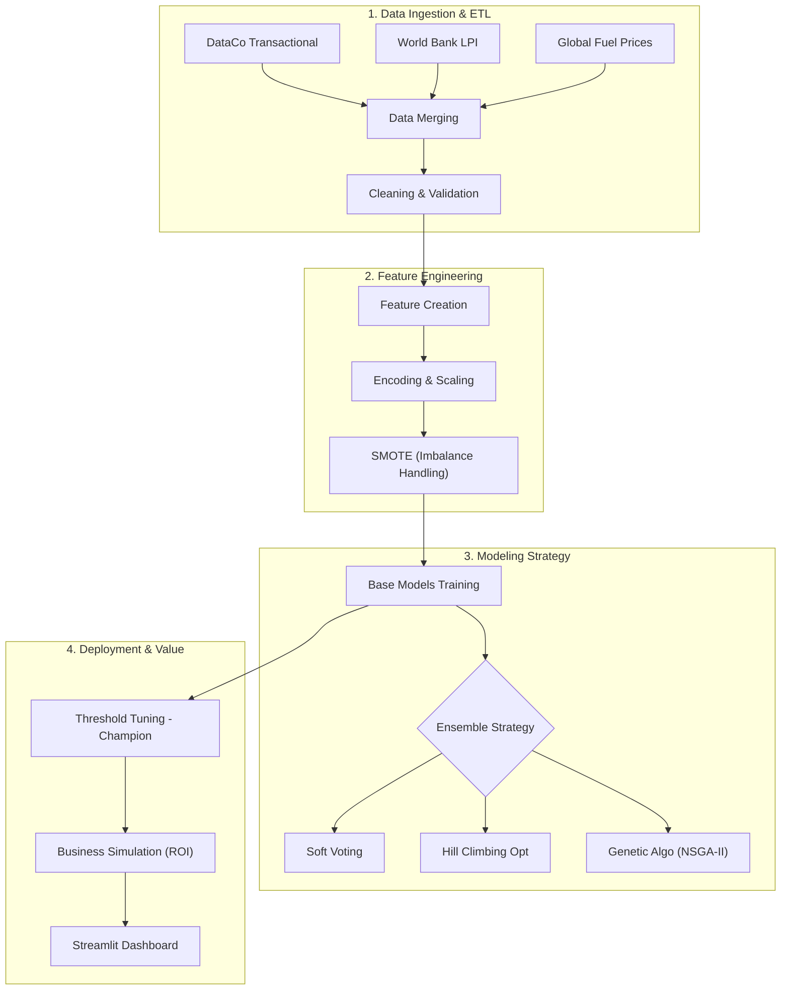

# AI-Driven Logistics Risk Predictor & Delivery Optimization

[](https://logistics-ai-optimization.streamlit.app/)


> **Repository:** [github.com/ahmdtrdi/LogisticAIOptimization](https://github.com/ahmdtrdi/LogisticAIOptimization.git)

**Transforming Supply Chain from Reactive to Proactive.**
This project is an End-to-End Data Science solution integrating internal transactional data with external macro-economic indicators (Global Fuel Prices & World Logistics Index) to predict delivery delay risks and automatically optimize operational costs.

🔗 **Live Dashboard:** [Click here for App Demo](https://logistics-ai-optimization.streamlit.app/)

---

## 🏗️ End-to-End Pipeline Architecture

The system is built upon a robust ETL pipeline and a multi-tiered modeling strategy, ranging from raw data ingestion to business dashboard deployment.



## Data Sources & Integration

To enhance model accuracy regarding external factors, I performed **Data Enrichment** by integrating 3 distinct datasets:

1.  **Transactional Data (Internal):**
    * **Source:** DataCo SMART SUPPLY CHAIN FOR BIG DATA ANALYSIS (Mendeley Data).
    * **Role:** Main dataset containing 180k+ order histories, delivery statuses, and customer locations.
    * **Citation:** Constante, Fabian; Silva, Fernando; Pereira, António (2019), “DataCo SMART SUPPLY CHAIN FOR BIG DATA ANALYSIS”, Mendeley Data, V5, doi: 10.17632/8gx2fvg2k6.5.

2.  **Logistics Performance Index (External):**
    * **Source:** World Bank LPI (2007-2023).
    * **Role:** Provides infrastructure context of the destination country. Countries with lower LPI imply higher delay risks.
    * **Integration:** Merged based on `Order Country` & `Order Year`.

3.  **Global Fuel Prices (External):**
    * **Source:** World Bank Data Catalog (Gas Prices).
    * **Role:** Captures global transport cost fluctuations impacting logistics vendor performance.
    * **Integration:** Merged based on `Order Country` & `Order Year` (Time-series interpolation).

---

## Modeling & Ensemble Strategy

The experiment focused on balancing **AUC Score** (discriminative power) and **Business Recall** (risk capture capability).

### 1. Base Models
I trained strong baseline models:
* **Random Forest:** Captures complex non-linear patterns.
* **XGBoost & CatBoost:** Gradient boosting for high accuracy on tabular data.
* **Logistic Regression:** As an interpretable linear baseline.

### 2. Advanced Ensemble Techniques
I applied advanced optimization techniques to combine predictions:
* **Soft Voting:** Weighted average probabilities.
* **Hill Climbing Optimization:** Local search algorithm to find the optimal model weights maximizing AUC.
* **Genetic Algorithms (CMA-ES & NSGA-II):** Using biological evolution to search for ensemble parameters in a vast search space.

### 3. Performance Benchmark

| Model Strategy | Test Accuracy | AUC Score | Status | Key Insight |
| :--- | :---: | :---: | :--- | :--- |
| **RandomForest (Baseline)** | 74.49% | 0.8963 | Solid Baseline | Strong model, but the default threshold (0.5) is less sensitive to risk. |
| **RF + Threshold Tuning** | **81.37%** | **0.8963** | 🏆 **CHAMPION** | Accuracy increased by **+6.88%** by shifting the decision boundary to **0.362**. Chosen for *Simplicity* & *Stability*. |
| **Soft Voting Ensemble** | 80.00% | 0.8797 | Stable | Consistent, but less sharp than Tuned RF. |
| **Hill Climbing Opt** | 81.30% | 0.8915 | Runner-up | Highly competitive, but computationally heavier without significant gain. |
| **Genetic Algo (CMA-ES)** | 81.47% | 0.8937 | Experimental | Best technical ensemble, but marginal gain (<0.1%) does not justify deployment complexity. |
| **NSGA-II Ensemble** | 81.38% | 0.8935 | Competitive | Consistent in multi-objective optimization, but uplift remains thin compared to Tuned RF. |

> **Decision:** I selected **Random Forest with Threshold Tuning** as the *Champion Model* for deployment based on *Occam's Razor*: The simplest solution with the best results is the most reliable for production.

---

## Business Impact Simulation

This project translates Machine Learning metrics into **Dollar Value ($)**.

**Business Assumptions:**
* **Intervention Cost (Preventive):** $15 (Upgrade to Expedited Shipping).
* **Late Penalty (Risk):** $50 (Penalty + Churn Risk).

**AI Mechanism:**
If Risk Probability > Threshold (0.362), the system recommends **INTERVENTION**.
* **Without AI:** I let the risk happen -> Pay Penalty $50.
* **With AI:** I pay $15 upfront -> Save $35 per risky order.

**Simulation Results (On Test Data):**
* **Cost Efficiency:** ~53% reduction in total operational costs.
* **Net Savings:** Massive potential savings at high volume scale.

---

## Tech Stack

* **Language:** Python 3.10
* **Data Engineering:** Pandas, NumPy
* **Machine Learning:** Scikit-Learn, XGBoost, CatBoost, Imbalanced-learn
* **Optimization:** Optuna (Hyperparameter), Hill Climbing custom script
* **Visualization:** Plotly Express, Matplotlib
* **Deployment:** Streamlit Cloud

---

## How to Run Locally

1.  **Clone Repository**
    ```bash
    git clone [https://github.com/ahmdtrdi/LogisticAIOptimization.git](https://github.com/ahmdtrdi/LogisticAIOptimization.git)
    cd LogisticAIOptimization
    ```

2.  **Install Requirements**
    Using a Virtual Environment is recommended.
    ```bash
    pip install -r requirements.txt
    ```

3.  **Run Dashboard**
    ```bash
    streamlit run dashboard.py
    ```

4.  **Access Dashboard**
    Open your browser at `http://localhost:8501`.

---

### Author
**Triadi M**
* [GitHub](https://github.com/ahmdtrdi)
* [LinkedIn](https://www.linkedin.com/in/triadim/)
